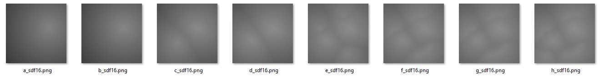

# Signed-Distance-Field-2D-Generator

生成有符号距离场 Signed Distance Field (SDF)，以及多张SDF的合成。可用于二次元面部渲染以及云层渲染。

## 算法以及描述

参考：

https://cronrpc.github.io/zh/posts/signed-distance-field/

## 使用方式：

首先获取几张bit图：


```
$ python fast_edt.py demo/*.png
Saved SDF to demo/a_sdf16.png
Saved SDF to demo/b_sdf16.png
Saved SDF to demo/c_sdf16.png
Saved SDF to demo/d_sdf16.png
Saved SDF to demo/e_sdf16.png
Saved SDF to demo/f_sdf16.png
Saved SDF to demo/g_sdf16.png
Saved SDF to demo/h_sdf16.png
```

生成的SDF图片：



合并SDF图：

```
$ python compose_multiple.py demo/*_sdf16.png
合成完成: output8.png，合并了 8 张图片
```

输出如下：


查看效果：

