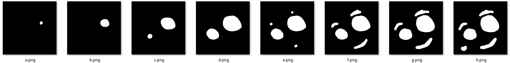
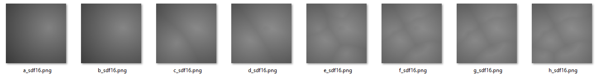
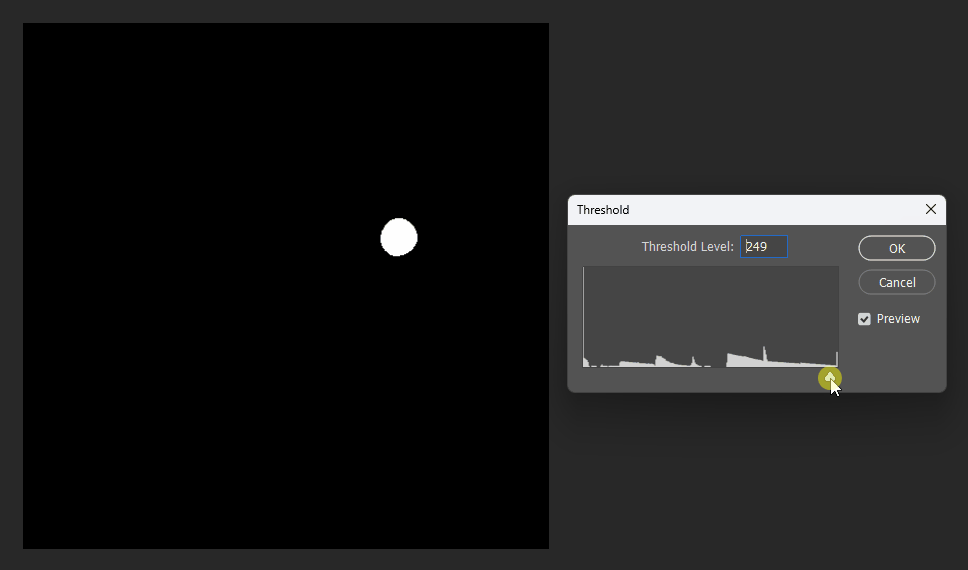

# Signed-Distance-Field-2D-Generator

## Algorithm and Description

Reference:
[https://cronrpc.github.io/zh/posts/signed-distance-field/](https://cronrpc.github.io/zh/posts/signed-distance-field/)

## How to Use

First, prepare a few bitmap images:



Then run the script:

```
$ python fast_edt.py demo/*.png
Saved SDF to demo/a_sdf16.png
Saved SDF to demo/b_sdf16.png
Saved SDF to demo/c_sdf16.png
Saved SDF to demo/d_sdf16.png
Saved SDF to demo/e_sdf16.png
Saved SDF to demo/f_sdf16.png
Saved SDF to demo/g_sdf16.png
Saved SDF to demo/h_sdf16.png
```

Here’s what the generated SDF images look like:



Next, you can merge multiple SDF images:

```
$ python compose_multiple.py demo/*_sdf16.png
Composition done: output8.png, merged 8 images
```

Check out the result:

